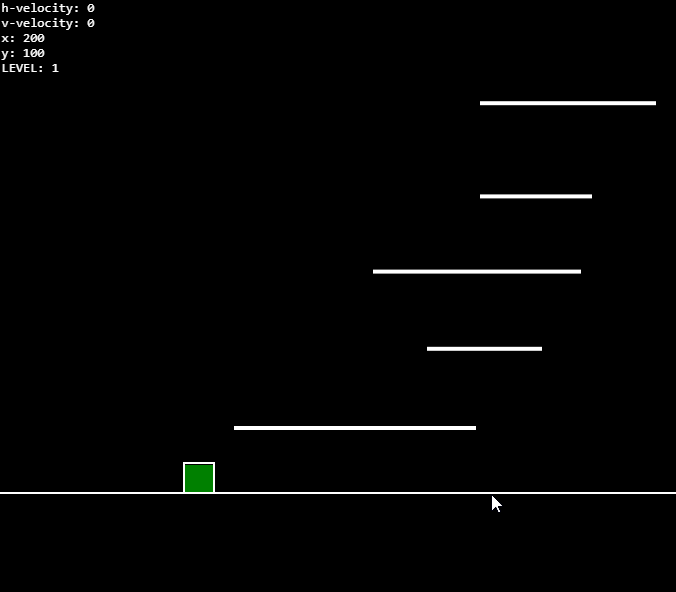

# jump-js
A little jumping game written in pure javascript

Current features are:
- gravity
- double-jump
- random platforms generation
- "step-down" from a platform
- iced platforms
- reach the top to go to the next level
- the highest the level, the more iced platforms

[Live demo!](https://hijackit.github.io/jump-js/)

## Ideas
A few ideas for next iterations:
- create a goal (eg. reach the top of the screen -> goto next level)
- display the current level
- "sprint" with double tap (e.g. pressing the right button 2 times)
- shooting